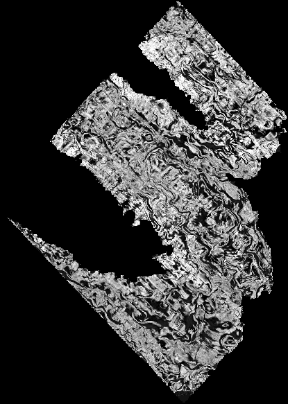
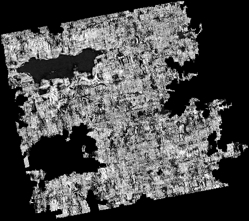

# vesuvius-topo

[](https://molab.marimo.io/notebooks/nb_eF8cCqwY2tb84FGRj9dE4h)

Recurrent surface tracking and deterministic virtual-unwrapping exports for the Vesuvius Challenge.

## Overview

This toolkit predicts local 3D surface continuation, confidence, and uncertainty. Its authoritative output is an XYZ surface map (`[H,W,3]`), not a PNG. The renderer uses that map to sample a CT volume along surface normals and optionally runs a TorchScript ink model.

## Mesh Creation Approach

Two complementary unwrapping paths provide dense surface coverage:

### Grid-Mesh Unwrap (`mesh-unwrap`)

Builds a dense grid mesh directly from the probability field using PCA projection for UV parameterization. This approach:

1. **Extracts** the connected component of voxels above a probability threshold at the seed location
2. **Selects** the seed's layer via PCA depth projection, isolating a sheet-like region
3. **Rasterizes** 3D points into a 2D grid using weighted averaging (probability-weighted centroid with ridge preference)
4. **Fills holes** via linear/nearest interpolation for missing grid cells
5. **Optimizes** surface positions iteratively by projecting vertices onto the probability ridge
6. **Builds** a triangle mesh from the valid grid, selecting the seed's connected component
7. **Rasterizes** the mesh using natural grid UV coordinates for reliable texturing

Because UV coordinates derive from the grid structure, triangles never fold or invert—making this method ideal for initial exploration and large-area coverage.

### Topology-Aware Unwrap (`topology-unwrap`)

Extracts the probability ridge as a triangle mesh and flattens it with conformal parameterization. This path:

1. **Computes** Hessian eigenanalysis to identify probability ridge points and normals
2. **Extracts** the ridge mesh via marching cubes, rejecting degenerate faces
3. **Removes** non-manifold faces and cross-layer bridge edges that violate surface continuity
4. **Selects** a geodesic disk around the seed, automatically filling inner boundary loops
5. **Initializes** UV coordinates harmonically (LSCM fallback) and refines them with SLIM
6. **Rejects** mixed-sign UV triangles instead of rasterizing folds

This approach produces higher-fidelity parameterization suitable for production-quality unwrappings where metric accuracy matters.

## Rendered Surfaces


*Candidate 244: High-adherence surface with low fold/jump rates*


*Candidate 472: Another successfully unwrapped region showing sheet structure*

---

## Install

```bash
python -m venv .venv
. .venv/bin/activate
pip install -e '.[dev]'
```

Python 3.11-3.13 is recommended for GPU environments.

## Pipeline

Generate pseudo-trajectories from a bounded crop of the public PHerc0332 prediction. Bounds are at the selected pyramid level and ordered `z0,z1,y0,y1,x0,x1`.

```bash
vesuvius-ssm prepare \
  --level 2 \
  --bounds 500,756,300,556,300,556 \
  --count 2000 \
  --output artifacts/trajectories
```

Train the recurrent tracker:

```bash
vesuvius-ssm train \
  --trajectories artifacts/trajectories \
  --epochs 20 \
  --output artifacts/tracker.pt
```

For dense coverage, prefer the mesh-first path. It extracts the connected component selected by the seed, isolates the seed's layer, parameterizes it into UV, fills enclosed holes, and reports topology quality gates:

```bash
vesuvius-ssm mesh-unwrap \
  --level 3 \
  --bounds 292,388,80,176,194,290 \
  --seed-xyz 7008,3168,9856 \
  --threshold 0.4 \
  --layer-half-thickness 64 \
  --output artifacts/mesh-surface.npz
```

Coverage is measured only inside the detected sheet mask. A result should not be treated as production quality unless probability adherence is high and both folded-quad and long-edge-jump rates pass their configured acceptance thresholds.

For topology-validated output, install the mesh dependencies and use the ridge-mesh parameterizer:

```bash
uv sync --extra mesh
vesuvius-ssm topology-unwrap \
  --level 3 \
  --bounds 292,388,80,176,194,290 \
  --seed-xyz 7008,3168,9856 \
  --patch-radius 1440 \
  --spacing 32 \
  --slim-iterations 10 \
  --output artifacts/topology-surface.npz
```

This path extracts the probability ridge rather than the boundary of its thick band, rejects cross-layer bridge edges, crops a geodesic disk, fills only small interior boundary loops, initializes UV coordinates harmonically, and refines them with SLIM. It rejects mixed-sign UV triangles instead of rasterizing folds.

## Large-Scale Search

The four search phases are independently resumable:

```bash
# Phase 1: coarse whole-scroll surface candidates
vesuvius-ssm search-generate \
  --level 5 --maximum-candidates 10000 \
  --output artifacts/search/candidates.json

# Phase 2: chunk-cached sparse level-0 CT and optional ink scoring
vesuvius-ssm search-score \
  --manifest artifacts/search/candidates.json \
  --cache-gib 8 --size 64 --depth 30

# Phase 3: spatial and surface-normal deduplication
vesuvius-ssm search-nms \
  --manifest artifacts/search/candidates.json \
  --minimum-distance 256 --limit 100 \
  --output artifacts/search/winners.json

# Phase 4: topology-valid unwrapping of ranked winners
vesuvius-ssm search-unwrap \
  --manifest artifacts/search/winners.json \
  --limit 20 --output artifacts/search/unwrapped
```

Phase 2 groups candidates by CT chunk and reuses decompressed chunks through a bounded LRU cache. The manifest is atomically checkpointed during scoring, so interrupted Molab jobs can resume without rescanning completed candidates.

Grow and checkpoint a 2D XYZ map. Seed coordinates use CT level-0 `x,y,z` order. The public surface prediction starts at CT level 2, so the loader applies its required `4x` registration scale automatically. The crop must contain the full requested rollout.

```bash
vesuvius-ssm rollout \
  --level 2 \
  --bounds 500,756,300,556,300,556 \
  --model artifacts/tracker.pt \
  --seed-xyz 6656,6336,15232 \
  --u-direction 1,0,0 \
  --height 256 --width 256 \
  --output artifacts/surface.npz
```

Render after the complete rollout, using the corresponding source CT OME-Zarr:

```bash
vesuvius-ssm render \
  --surface artifacts/surface.npz \
  --layers 30 --offset-min -15 --offset-max 14 \
  --output artifacts/render
```

The renderer defaults to the public PHerc0332 `20251211183505-2.399um-0.2m-78keV-masked.zarr` CT volume. It writes `surface_layers.tif`, `unwrapped_ct.tif`, `unwrapped_ct.png`, `confidence.png`, and `surface.ply`, reading only the CT bounding box required by the completed surface.

## Ink Adapter

Ink inference is optional and expects a TorchScript model accepting Villa's native `[B,1,D,H,W]` tensor. Supply a JSON manifest:

```json
{
  "depth": 30,
  "input_size": 64,
  "clip_max": 200.0,
  "scale_divisor": 255.0,
  "reverse_depth": false,
  "raw_output_size": 4
}
```

```bash
vesuvius-ssm render \
  --ct-volume s3://bucket/path/to/ct.zarr \
  --surface artifacts/surface.npz \
  --ink-model artifacts/ink.ts \
  --ink-manifest artifacts/ink-manifest.json \
  --output artifacts/render
```

The Villa checkpoint must be exported with its exact architecture first. The manifest deliberately makes depth, depth direction, spatial tile size, and preprocessing explicit because these differ between the legacy TimeSformer and newer ResNet3D checkpoints.
