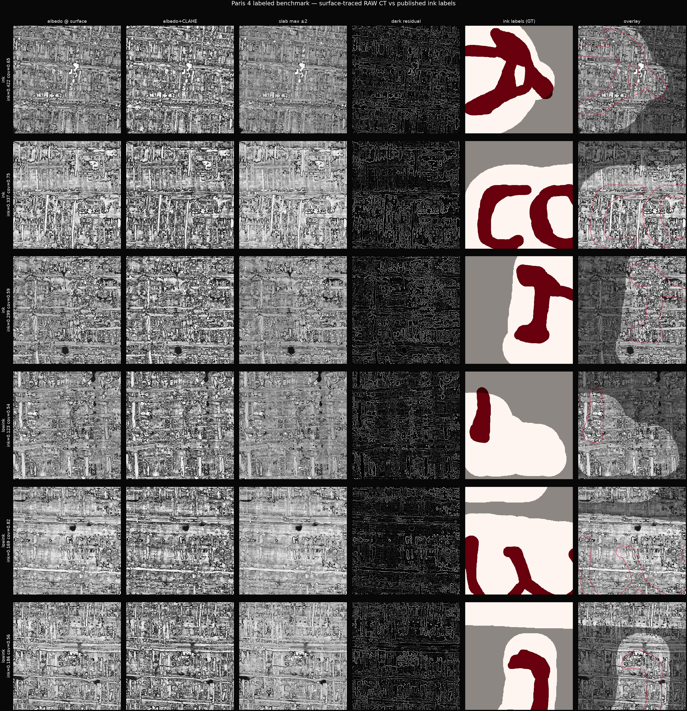
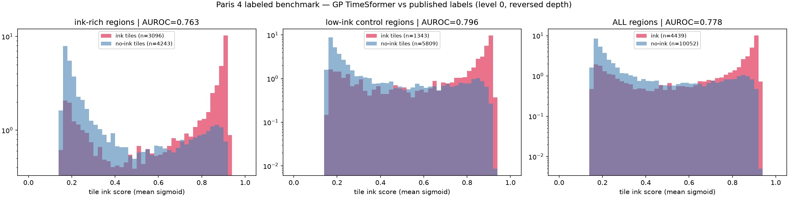
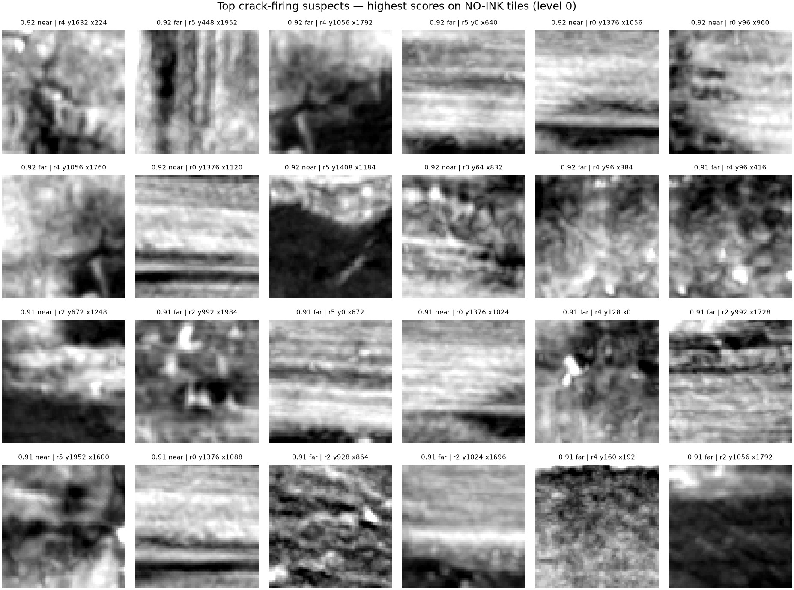

# vesuvius-topo

[](https://molab.marimo.io/notebooks/nb_eF8cCqwY2tb84FGRj9dE4h)

Recurrent surface tracking and deterministic virtual-unwrapping exports for the Vesuvius Challenge.

## Overview

This toolkit predicts local 3D surface continuation, confidence, and uncertainty. Its authoritative output is an XYZ surface map (`[H,W,3]`), not a PNG. The renderer uses that map to sample a CT volume along surface normals and optionally runs a TorchScript ink model.

## Mesh Creation Approach

Two complementary unwrapping paths provide dense surface coverage:

### Grid-Mesh Unwrap (`mesh-unwrap`)

Builds a dense grid mesh directly from the probability field using PCA projection for UV parameterization. This approach:

1. **Extracts** the connected component of voxels above a probability threshold at the seed location
2. **Selects** the seed's layer via PCA depth projection, isolating a sheet-like region
3. **Rasterizes** 3D points into a 2D grid using weighted averaging (probability-weighted centroid with ridge preference)
4. **Fills holes** via linear/nearest interpolation for missing grid cells
5. **Optimizes** surface positions iteratively by projecting vertices onto the probability ridge
6. **Builds** a triangle mesh from the valid grid, selecting the seed's connected component
7. **Rasterizes** the mesh using natural grid UV coordinates for reliable texturing

Because UV coordinates derive from the grid structure, triangles avoid folding and inversion, making this method ideal for initial exploration and large-area coverage.

### Topology-Aware Unwrap (`topology-unwrap`)

Extracts the probability ridge as a triangle mesh and flattens it with conformal parameterization. This path:

1. **Computes** Hessian eigenanalysis to identify probability ridge points and normals
2. **Extracts** the ridge mesh via marching cubes, rejecting degenerate faces
3. **Removes** non-manifold faces and cross-layer bridge edges that violate surface continuity
4. **Selects** a geodesic disk around the seed, automatically filling inner boundary loops
5. **Initializes** UV coordinates harmonically (LSCM fallback) and refines them with SLIM
6. **Rejects** mixed-sign UV triangles instead of rasterizing folds

---

## Usage

```bash
python -m venv .venv
. .venv/bin/activate
pip install -e '.[dev]'
```

Python 3.11-3.13 is recommended for GPU environments.

## Pipeline

Generate pseudo-trajectories from a bounded crop of the public PHerc0332 prediction. Bounds are at the selected pyramid level and ordered `z0,z1,y0,y1,x0,x1`.

```bash
vesuvius-ssm prepare \
  --level 2 \
  --bounds 500,756,300,556,300,556 \
  --count 2000 \
  --output artifacts/trajectories
```

Train the recurrent tracker:

```bash
vesuvius-ssm train \
  --trajectories artifacts/trajectories \
  --epochs 20 \
  --output artifacts/tracker.pt
```

For dense coverage, prefer the mesh-first path. It extracts the connected component selected by the seed, isolates the seed's layer, parameterizes it into UV, fills enclosed holes, and reports topology quality gates:

```bash
vesuvius-ssm mesh-unwrap \
  --level 3 \
  --bounds 292,388,80,176,194,290 \
  --seed-xyz 7008,3168,9856 \
  --threshold 0.4 \
  --layer-half-thickness 64 \
  --output artifacts/mesh-surface.npz
```

Coverage is measured only inside the detected sheet mask. A result should not be treated as production quality unless probability adherence is high and both folded-quad and long-edge-jump rates pass their configured acceptance thresholds.

For topology-validated output, install the mesh dependencies and use the ridge-mesh parameterizer:

```bash
uv sync --extra mesh
vesuvius-ssm topology-unwrap \
  --level 3 \
  --bounds 292,388,80,176,194,290 \
  --seed-xyz 7008,3168,9856 \
  --patch-radius 1440 \
  --spacing 32 \
  --slim-iterations 10 \
  --output artifacts/topology-surface.npz
```

This path extracts the probability ridge rather than the boundary of its thick band, rejects cross-layer bridge edges, crops a geodesic disk, fills only small interior boundary loops, initializes UV coordinates harmonically, and refines them with SLIM. It rejects mixed-sign UV triangles instead of rasterizing folds.

## Large-Scale Search

The four search phases are independently resumable:

```bash
# Phase 1: coarse whole-scroll surface candidates
vesuvius-ssm search-generate \
  --level 5 --maximum-candidates 10000 \
  --output artifacts/search/candidates.json

# Phase 2: chunk-cached sparse level-0 CT and optional ink scoring
vesuvius-ssm search-score \
  --manifest artifacts/search/candidates.json \
  --cache-gib 8 --size 64 --depth 30

# Phase 3: spatial and surface-normal deduplication
vesuvius-ssm search-nms \
  --manifest artifacts/search/candidates.json \
  --minimum-distance 256 --limit 100 \
  --output artifacts/search/winners.json

# Phase 4: topology-valid unwrapping of ranked winners
vesuvius-ssm search-unwrap \
  --manifest artifacts/search/winners.json \
  --limit 20 --output artifacts/search/unwrapped
```

Phase 2 groups candidates by CT chunk and reuses decompressed chunks through a bounded LRU cache. The manifest is atomically checkpointed during scoring, so interrupted Molab jobs can resume without rescanning completed candidates.

Grow and checkpoint a 2D XYZ map. Seed coordinates use CT level-0 `x,y,z` order. The public surface prediction starts at CT level 2, so the loader applies its required `4x` registration scale automatically. The crop must contain the full requested rollout.

```bash
vesuvius-ssm rollout \
  --level 2 \
  --bounds 500,756,300,556,300,556 \
  --model artifacts/tracker.pt \
  --seed-xyz 6656,6336,15232 \
  --u-direction 1,0,0 \
  --height 256 --width 256 \
  --output artifacts/surface.npz
```

Render after the complete rollout, using the corresponding source CT OME-Zarr:

```bash
vesuvius-ssm render \
  --surface artifacts/surface.npz \
  --layers 30 --offset-min -15 --offset-max 14 \
  --output artifacts/render
```

The renderer defaults to the public PHerc0332 `20251211183505-2.399um-0.2m-78keV-masked.zarr` CT volume. It writes `surface_layers.tif`, `unwrapped_ct.tif`, `unwrapped_ct.png`, `confidence.png`, and `surface.ply`, reading only the CT bounding box required by the completed surface.

## TIF XYZ Export

Export the surface grid as multi-channel TIF files for downstream processing. The `mesh-unwrap` or `topology-unwrap` output (`.npz`) contains `xyz`, `normals`, `confidence`, and `valid` arrays. Convert these to TIF:

```python
import numpy as np
import tifffile

data = np.load("artifacts/mesh-surface.npz")
xyz = data["xyz"].astype(np.float32)          # [H,W,3] CT level-0 coordinates (NaN outside sheet)
normals = data["normals"].astype(np.float32)   # [H,W,3] surface normals (NaN outside sheet)
confidence = data["confidence"].astype(np.float32)  # [H,W] per-pixel confidence
valid = data["valid"]                          # [H,W] boolean mask

# NaN → 0 for TIF export (NaN breaks most viewers)
tifffile.imwrite("artifacts/surface_xyz.tif", np.nan_to_num(xyz, nan=0.0), compression="zlib")
tifffile.imwrite("artifacts/surface_normals.tif", np.nan_to_num(normals, nan=0.0), compression="zlib")
tifffile.imwrite("artifacts/surface_confidence.tif", np.nan_to_num(confidence, nan=0.0), compression="zlib")
tifffile.imwrite("artifacts/surface_valid.tif", (valid * 255).astype(np.uint8), compression="zlib")

# Combined XYZ + confidence + valid (5 channels)
combined = np.concatenate([
    np.nan_to_num(xyz, nan=0.0),
    np.nan_to_num(confidence, nan=0.0)[..., None],
    valid[..., None].astype(np.float32),
], axis=-1)
tifffile.imwrite("artifacts/surface_xyz_confidence_valid.tif", combined, compression="zlib")
```

Produced TIF files:

| File | Shape | Dtype | Description |
|:---|:---|:---|:---|
| `surface_xyz.tif` | `[H,W,3]` | float32 | XYZ coordinates in CT level-0 voxels (0 outside sheet) |
| `surface_normals.tif` | `[H,W,3]` | float32 | Unit surface normals (0 outside sheet) |
| `surface_confidence.tif` | `[H,W]` | float32 | Per-pixel confidence (0–1) |
| `surface_valid.tif` | `[H,W]` | uint8 | Binary mask (255 = valid surface pixel) |
| `surface_xyz_confidence_valid.tif` | `[H,W,5]` | float32 | XYZ + confidence + valid mask packed |

The `.npz` stores NaN for invalid pixels (outside the papyrus sheet). Always use `np.nan_to_num(..., nan=0.0)` before writing TIF — NaN breaks most image viewers and downstream consumers. The `surface_valid.tif` mask distinguishes genuine zeros from missing data.

The `render` command additionally produces `surface_layers.tif` (CT stack sampled along normals) and `unwrapped_ct.tif` (center layer). Pixels outside the valid surface mask are zero-filled.

## Paris 4 Labeled Benchmark

An end-to-end validation of the render pass and ink pipeline against published ground truth: the labeled PHerc. Paris 4 tutorial segment `w00_20231016151002` (geometry, ink labels, and supervision mask from the `scrollprize` HF bucket). Unlike the PHerc0332 search volume, this segment ships its own 65-layer surface volume (`w00_20231016151002.zarr`, OME multiscale levels 0–5, canvas 32249×51380 exactly matching the labels), so no full-scroll sampling is needed.

### Surface-Traced Renders

The flattening pass traces the sheet through each depth column of a raw CT slab instead of projecting a fixed tangent plane:

1. **Argmax** of a spatially smoothed depth profile per column
2. **Sub-voxel parabolic refinement** of the peak position
3. **Median + gaussian regularization** of the depth map
4. **Albedo interpolation** from the *raw* slab at the traced surface, so ink contrast is not blurred by the tracing smoothing

Six 1024×1024 level-1 regions were rendered — three ink-rich, three low-ink controls (every supervised block in this segment contains some ink, so the control is relative) — with the published labels overlaid as ground truth:



Per-region panels (albedo @ surface, albedo+CLAHE, slab max ±2, dark residual, GT labels, overlay) live in `ink_renders/p4_benchmark/` (`r0`–`r5`).

### GP TimeSformer Model Contract

Scoring with the Grand Prize TimeSformer (`timesformer_wild15_20230702185753_0_fr_i3depoch=12.ckpt`, from the [GP repo](https://github.com/younader/Vesuvius-Grandprize-Winner)'s Drive link) initially returned **chance-level** scores (AUROC ≈ 0.49). The failure was not labels, resolution, or registration — it was the model contract, verified against the GP training/inference code:

| Contract detail | Value | Consequence if wrong |
|:---|:---|:---|
| Depth frames | 26 (not 30), `timesformer-pytorch==0.3.3` API `[B,F,C,H,W]` | shape errors / silent distribution shift |
| Depth window | **fixed** layers 17–42 | per-tile argmax centering *hurts*: AUROC 0.78 vs 0.87 |
| Depth order | **reversed** for this segment family (predecessor `20231016151000` is on the GP reverse list) | AUROC 0.43 → **0.87** |
| Preprocessing | clip at 200, divide by 255, native level-0 resolution | mild degradation |
| Output | 4×4 logit grid → sigmoid → mean | — |

### Scoring Results

64×64 tiles, stride 32, at native level-0 resolution. Positives: supervised tiles with ≥30% ink; negatives: supervised tiles with zero ink. Overall **AUROC 0.778** (4,439 pos / 10,052 neg), mean score 0.66 ink vs 0.39 no-ink.

| Region | Kind | AUROC | no-ink ≥0.5 | no-ink ≥0.9 |
|:---|:---|---:|---:|---:|
| r0 y2048 x17408 | ink | 0.786 | 23.1% | 0.9% |
| r1 y6144 x15360 | ink | 0.856 | 25.4% | 0.6% |
| r2 y2048 x9216 | ink | 0.627 | 47.9% | 3.0% |
| r3 y8192 x1024 | low-ink | 0.776 | 38.7% | 0.1% |
| r4 y6144 x10240 | low-ink | 0.813 | 28.2% | 0.8% |
| r5 y3072 x12288 | low-ink | 0.810 | 20.3% | 0.7% |
| **Overall** | | **0.778** | **30.5%** | **0.96%** |



Tile-level AUROC understates the model: solid-blob labels mean "ink tiles" include non-ink pixels, and "no-ink" tiles include unlabeled strokes. The high-confidence tail is the cleaner signal.

### Crack-Firing Analysis

The benchmark's motivation: how often does the model fire on cracks and texture instead of ink?

- **30.5%** of no-ink tiles score ≥0.5 — the model fires *weakly* on texture almost everywhere (the flat tail in the histogram)
- Only **0.96%** score ≥0.9 — *confident* false firing is rare and concentrated (region r2: 3.0%, also the weakest AUROC)
- Firing is only modestly higher within 128 px of labeled ink than far from it (e.g. r5: 27.9% vs 18.5%), so label dilation explains little of it

The top false-firing suspects fall into three buckets: horizontal **layer-boundary/crack bands** (genuine crack-firing), dark curvilinear marks that are **likely unlabeled ink** (label noise inflating the apparent rate), and plain dark blotches:



Full machine-readable stats: `ink_renders/p4_benchmark/p4_benchmark_summary.json`. Score maps per region are saved as `.npy` for threshold sweeps.

## Ink Adapter

Ink inference expects a TorchScript model accepting Villa's native `[B,1,D,H,W]` tensor. Supply a JSON manifest:

```json
{
  "depth": 30,
  "input_size": 64,
  "clip_max": 200.0,
  "scale_divisor": 255.0,
  "reverse_depth": false,
  "raw_output_size": 4
}
```

```bash
vesuvius-ssm render \
  --ct-volume s3://bucket/path/to/ct.zarr \
  --surface artifacts/surface.npz \
  --ink-model artifacts/ink.ts \
  --ink-manifest artifacts/ink-manifest.json \
  --output artifacts/render
```

The Villa checkpoint must be exported with its exact architecture first. The manifest deliberately makes depth, depth direction, spatial tile size, and preprocessing explicit because these differ between the legacy TimeSformer and newer ResNet3D checkpoints. Depth direction also differs between *segment families*: scoring the Paris 4 tutorial segment with the wrong depth order drops the GP TimeSformer to chance-level AUROC (see [Paris 4 Labeled Benchmark](#paris-4-labeled-benchmark)).
